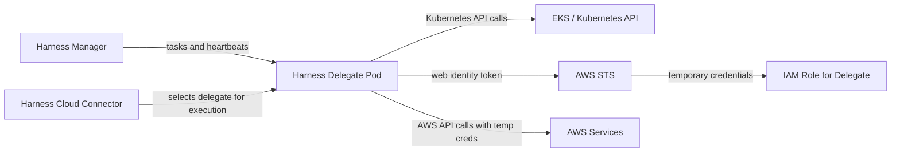
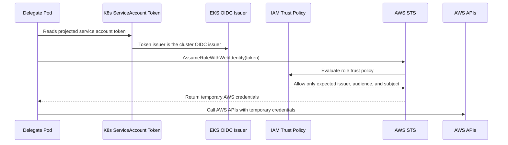
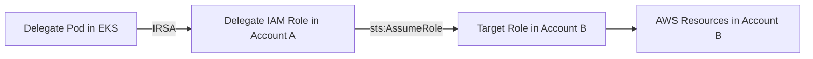

# AWS Delegate, Connectors, IRSA, and OIDC

This guide explains how the AWS path in this repository works at a high level.

It is written to answer questions like:

- What does the delegate actually do?
- Where do Harness cloud connectors fit in?
- Why do we need IRSA and OIDC?
- How does the delegate get AWS permissions without static keys?
- How would cross-account access work?

## Short version

- Terraform creates or targets an EKS cluster.
- EKS exposes an OIDC issuer for Kubernetes service accounts.
- Terraform creates an IAM role whose trust policy allows one specific Kubernetes service account to assume it by web identity.
- Terraform creates the delegate namespace, service account, secrets, and Helm release.
- The delegate pod runs in EKS and uses that service account.
- When the delegate needs AWS access, it uses IRSA to obtain AWS credentials dynamically.
- In Harness, cloud connectors point work at the delegate. The connector itself is not provisioned by this repository.

## The moving parts

### Harness Manager

The Harness control plane stores pipelines, delegates, connectors, and task definitions.

In this repo, Harness Manager is external. Terraform here does not create your Harness account resources. You still create the delegate token and any connectors in Harness.

### Harness delegate

The delegate is the worker that executes tasks on behalf of Harness.

In this repository, the delegate is:

- installed into Kubernetes with Helm through Terraform
- run in the `harness-delegate-ng` namespace by default
- attached to a dedicated Kubernetes service account
- configured to use an IAM role through IRSA

### Harness cloud connector

A cloud connector tells Harness how to talk to a platform such as AWS.

In this repo's AWS model, the connector usually does not hold long-lived AWS access keys. Instead:

- the connector routes work to the delegate
- the delegate uses its AWS identity from IRSA
- the delegate may optionally assume additional AWS roles if you configure that access path

That means the connector is a control-plane object in Harness, while the actual AWS credentials are obtained by the runtime delegate in EKS.

### OIDC provider

EKS publishes an OpenID Connect issuer for service accounts in the cluster.

AWS IAM can trust tokens from that issuer. This is what makes IRSA possible.

### IRSA

IRSA stands for IAM Roles for Service Accounts.

It allows a Kubernetes service account to obtain AWS credentials for a specific IAM role without storing static credentials in Kubernetes secrets or in Harness.

## End-to-end view



## What Terraform manages in this repository

At a high level, the AWS root stack wires these pieces together:

- `module.eks`
  - creates EKS when `create_eks = true`
  - exposes the cluster OIDC issuer URL and OIDC provider ARN
- `module.iam_irsa`
  - creates the IAM role and trust policy for the delegate service account
- `module.delegate`
  - creates the namespace and service account
  - annotates the service account with the IAM role ARN
  - creates the delegate token secret
  - installs the Helm chart

In `aws/main.tf`, the key flow is:

1. decide which cluster is the target cluster
2. resolve or receive OIDC information for that cluster
3. create the delegate IRSA role
4. pass the resulting role ARN into the delegate module
5. install the delegate Helm release with that service account

## How OIDC and IRSA fit together

This is the critical trust chain.



## What the IRSA trust policy is checking

The `aws/modules/iam-irsa` module builds an IAM trust policy that checks:

- the federated principal is the cluster's OIDC provider
- the token audience is `sts.amazonaws.com`
- the token subject matches the expected Kubernetes service account

In the strict default mode, the subject looks like this:

```text
system:serviceaccount:<namespace>:<service-account>
```

For the default delegate values in this repo, that is:

```text
system:serviceaccount:harness-delegate-ng:harness-delegate
```

That means only that exact service account can assume the role.

## Why this is better than static AWS keys

With this model:

- no long-lived AWS access key is stored in Harness
- no long-lived AWS access key is stored in Kubernetes secrets
- credentials are issued only when needed
- AWS access is tied to a specific Kubernetes service account
- permissions can be narrowed through IAM policy and optional role assumption

## Same-account vs cross-account access

There are two common AWS access patterns.

### Same-account access

The simplest model is:

- the delegate runs in account A
- the delegate IRSA role also lives in account A
- the resources the delegate needs are in account A

In that model, the delegate just uses the IRSA role directly.

### Cross-account access

A common pattern is:

- the delegate runs in account A
- the target infrastructure lives in account B
- the delegate first gets credentials for its IRSA role in account A
- then it calls `sts:AssumeRole` into a target role in account B

This repository supports that model through `assume_role_arns`.



For that to work:

- the delegate role must be allowed to call `sts:AssumeRole` on the target role ARN
- the target role trust policy must trust the delegate role
- the Harness connector or pipeline configuration must use the right role or account path

## Where cloud connectors fit

A common source of confusion is that the connector and the credentials are not the same thing.

### In Harness

You create the connector in Harness.

The connector usually defines things like:

- which delegate should execute the work
- which AWS account or role the work should target
- any connector-level options required by the Harness feature you are using

### In this repository

Terraform prepares the runtime identity the delegate uses:

- Kubernetes service account
- IAM role for IRSA
- optional cross-account assume-role permissions

So the connector points at the delegate, and the delegate uses the identity created by this repo.

## How Kubernetes access works

The delegate runs inside the cluster, so it already has an in-cluster Kubernetes identity.

This repo configures the delegate chart with:

- a dedicated service account
- a permissions mode such as `CLUSTER_ADMIN` or `CLUSTER_VIEWER`

That controls what the delegate can do inside Kubernetes.

This is separate from AWS IAM permissions.

A useful mental model is:

- Kubernetes RBAC decides what the delegate can do inside the cluster
- AWS IAM decides what the delegate can do against AWS APIs

## What this repo creates vs what you still do manually

### Created by Terraform here

- EKS cluster, if enabled
- EKS OIDC integration outputs
- delegate IAM role for IRSA
- delegate namespace and service account
- delegate token secret and optional upgrader token secret
- delegate Helm release

### Created outside this repo

- the delegate token itself in Harness
- Harness connectors
- any target-account IAM roles that should trust the delegate for cross-account access
- any Harness pipelines or environments that use the delegate

## Delegate image versioning

This repository resolves the delegate image tag from the public Google Artifact Registry when `delegate_image_tag` is left empty.

The flow is:

- Terraform queries the public GAR tags endpoint
- it filters for plain release tags that match the expected version format
- it selects the highest version
- the Helm chart is installed with that explicit image

You can still pin a version by setting `delegate_image_tag`.

## Existing cluster mode vs new cluster mode

There are two OIDC resolution paths.

### New cluster in the same Terraform stack

When Terraform is creating EKS in the same apply:

- the EKS module returns `oidc_provider_arn`
- the EKS module returns `cluster_oidc_issuer_url`
- the IRSA module uses those values directly

### Existing cluster

When Terraform is targeting an existing cluster:

- the IRSA module reads the cluster
- it discovers the OIDC issuer URL
- it looks up the IAM OIDC provider by URL
- it builds the trust policy from that discovered information

## Practical troubleshooting hints

### The delegate starts but AWS calls fail

Check:

- the service account annotation contains the expected role ARN
- the IAM trust policy subject matches the namespace and service account
- the target role trust policy is correct if you are doing cross-account access
- the delegate IAM policy includes the AWS actions your use case needs

### Terraform cannot resolve OIDC

Check:

- whether you are in new-cluster mode or existing-cluster mode
- whether `resolve_from_cluster` is using the intended path
- whether the EKS cluster actually has an IAM OIDC provider associated with it

### The connector exists but nothing can deploy

Check:

- that the connector is actually selecting the delegate you installed
- that the delegate is healthy in the Harness UI
- that the delegate has both the Kubernetes permissions and AWS permissions needed for the task

## Quick mental model

If you only remember one thing, remember this:

- Harness decides what work should happen
- the connector decides where that work is aimed
- the delegate is the runtime worker that executes the work
- IRSA gives the delegate AWS credentials without static secrets
- OIDC is the trust mechanism that makes IRSA possible
